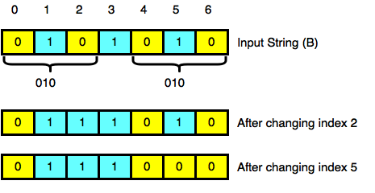

# Beautiful Binary String
Alice has a binary string. he thinks a binary string is beautiful if and only if it doesn't contain the substring `"101"`.

In one step, Alice can change a 0 to a 1 or vice versa. Count and print the minimum number of steps needed to make Alice see the string as beautiful.

### Example
`b = 100`
She can change any one element and have a beautiful string.

### FunctionDescription
beautifulBinaryString has the following parameter:
* string b: a string of binary digits.

### Returns
* int: the minimum moves required

### Input Format
The binary string b.

### Constraints
* `1 ≤ n ≤ 100 `

### Output Format
Print the minimum number of steps needed to make the string beautiful.

### Sample Input
    '0101010'

### Sample Output
    2

### Explanation
In this sample, `b = '0101010`.

Make the string beautiful by changing  2 characters `b[2] and b[5]`

## Answer:

[beautifulBinaryString](https://github.com/AbhilashTUofficial/Problem-Solving/blob/master/BeautifulBinaryString/ANSWER/beautifulBinaryString.py)