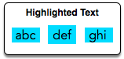

# Designer PDF Viewer
When a contiguous block of text is selected in a PDF viewer, the selection is highlighted with a blue rectangle. In this PDF viewer, each word is highlighted independently.

For example:

There is a list of `26` character heights aligned by index to their letters. For example, `a` is at index `0` and `z` is at index `25`. There will also be a string. Using the letter heights given, determine the area of the rectangle highlight in `mm²` assuming all letters are `1mm` wide.

### Example 
`h = [1, 3, 1, 3, 1, 4, 1, 3, 2, 5, 5, 5, 5, 5, 5, 5, 5, 5, 5, 5, 5, 5, 5, 5, 5, 5,]
word = 'torn'`

The heights are `t = 2, o =1, r = 1 and n = 1`. The tallest letter is `2` high and there are `4`letters. The hightlighted area will be `2 x 4 = 8mm²` so the answer is `8`.

### Function Description
Complete the `designerPdfViewer` function in the editor below.
`designerPdfViewer` has the following parameters:
* `int h[26]`: the heights of reach letters.
* `string word`: a string.

### Return
* int: the size of the highlighted area.

### Input Format
The first line contains `26` space-separated integers describing the respective heights of each consecutive lowercase English letters, `ascii[a-z]`.
The second line contains a single word consisting of lowercase English alphabetic letters.

### Constraints
* `1  ≤ h[x]  ≤ 7`, where `x` is an English lowercase letter.
* `word` contains no more than `10` letters.

### Sample Input
    1 3 1 3 1 4 1 3 2 5 5 5 5 5 5 5 5 5 5 5 5 5 5 5 5 5
    abc

### Sample Output
    9

### Explanation
We are highlighting the word abc:
Letter heights are `a = 1, b = 3 ,and c = 1`.The tallest letter, `b`,is `3mm` high. The selection area for this word is `3 x 1mm x 3mm = 9mm²`.

## Answer:

[designerPdfViewer](https://github.com/AbhilashTUofficial/Problem-Solving/blob/master/DesignerPdfViewer/ANSWER/designerPdfViewer.py)